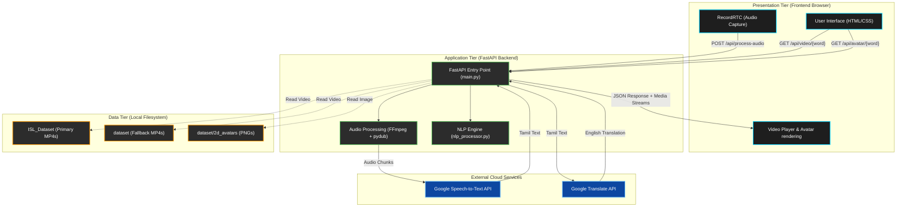
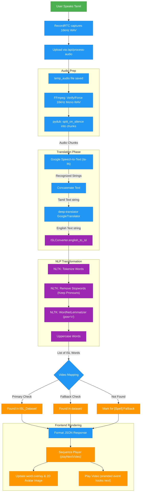

# Architecture Diagrams

Here are two detailed architectural diagrams for your project report. The first shows the overall system components (Frontend, Backend, Data, Cloud APIs), and the second details the exact step-by-step data flow through your translation pipeline.

*(Note: These are written in standard Mermaid charting syntax. You can take screenshots of the rendered diagrams below, or copy-paste the raw Mermaid code into a tool like [Mermaid Live Editor](https://mermaid.live/) to export high-quality PNG or SVG images for your Word document.)*

## 1. Overall System Architecture Diagram

This diagram illustrates the three-tier architecture of your system, showing how the frontend interacts with the FastAPI backend, local datasets, and external cloud services.

---

## 2. Translation Pipeline Data Flow Diagram

This flowchart outlines the chronological data processing pipeline, tracing the input from the moment the user speaks until the ISL video is played on screen.

